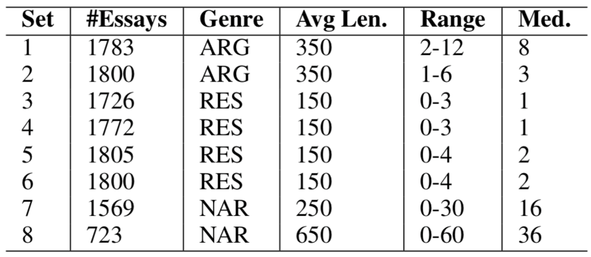

# Automated-Essay-Grading
An implementation of paper "[A Memory-Augmented Neural Model for Automated Grading](https://dl.acm.org/ft_gateway.cfm?id=3053982&ftid=1865482&dwn=1&CFID=92011169&CFTOKEN=5e86404040ee95d2-C94D3628-D29D-B939-636CA507CEAA3A7B)" in PyTorch.

## Requirements
- PyTorch 1.2.0
- scikit-learn
- six
- python3

## Usage
```
# Train on essay set 1
python train.py --set_id 1
```
There are serval flags within train.py.
```
  --gpu_id        GPU_ID
  --set_id        SET_ID         essay set id, 1 <= id <= 8.
  --emb_size      EMB_SIZE       Embedding size for sentences.
  --token_num     TOKEN_NUM      The number of token in glove (6, 42).
  --feature_size  FEATURE_SIZE   Feature size.
  --epochs        EPOCHS         Number of epochs to train for.
  --test_freq     TEST_FREQ      Evaluate and print results every x epochs.
  --hops          HOPS           Number of hops in the Memory Network.
  --lr            LR             Learning rate.
  --batch_size    BATCH_SIZE     Batch size for training.
  --l2_lambda     L2_LAMBDA      Lambda for l2 loss.
  --num_samples   NUM_SAMPLES    Number of samples selected as memories for each score.
  --epsilon       EPSILON        Epsilon value for Adam Optimizer.
  --max_grad_norm MAX_GRAD_NORM  Clip gradients to this norm.
  --keep_prob     KEEP_PROB      Keep probability for dropout.
```
Better performance can be get by tuning hyper-parameters.

## Dataset
The dataset comes from Kaggle ASAP competition. You can download the data from [https://www.kaggle.com/c/asap-aes/data](https://www.kaggle.com/c/asap-aes/data).

Dataset details:



## Glove
Pre-trained word embeddings are used in this model. You can download `glove_42B_300d` from [https://nlp.stanford.edu/projects/glove/](https://nlp.stanford.edu/projects/glove/).